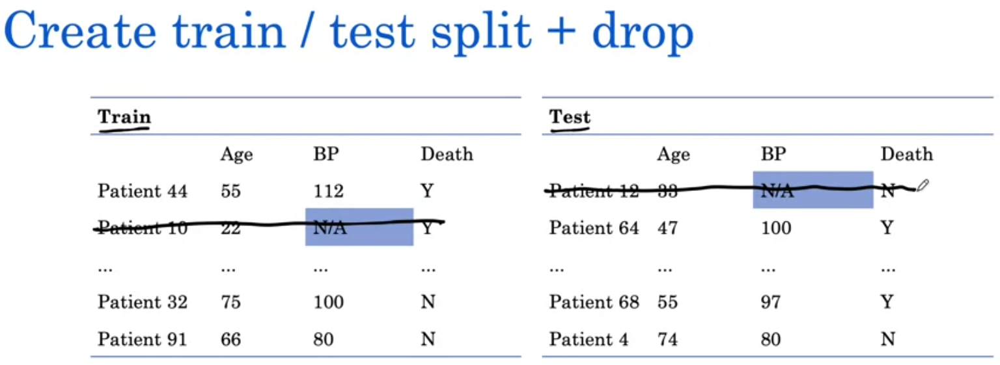
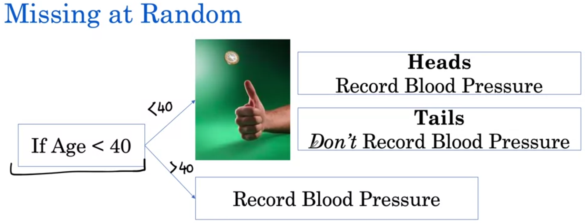
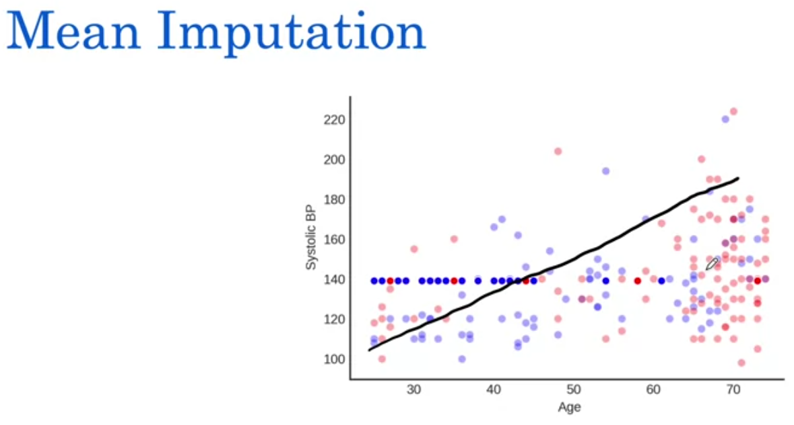

☀ 1. [Decision Trees for Prognosis](https://github.com/Anacoder1/AI-for-Medicine-Specialization-deeplearning.ai/blob/master/Course%202%20%E2%80%94%20AI%20for%20Medical%20Prognosis/Week%202%20%E2%80%94%20Prognosis%20with%20Tree-based%20Models/Week-2%20Notes.md#1-decision-trees-for-prognosis) 

☀ 2. [Decision Trees](https://github.com/Anacoder1/AI-for-Medicine-Specialization-deeplearning.ai/blob/master/Course%202%20%E2%80%94%20AI%20for%20Medical%20Prognosis/Week%202%20%E2%80%94%20Prognosis%20with%20Tree-based%20Models/Week-2%20Notes.md#2-decision-trees) 

☀ 3. [Dividing the Input Space](https://github.com/Anacoder1/AI-for-Medicine-Specialization-deeplearning.ai/blob/master/Course%202%20%E2%80%94%20AI%20for%20Medical%20Prognosis/Week%202%20%E2%80%94%20Prognosis%20with%20Tree-based%20Models/Week-2%20Notes.md#3-dividing-the-input-space) 

☀ 4. [Building a Decision Tree](https://github.com/Anacoder1/AI-for-Medicine-Specialization-deeplearning.ai/blob/master/Course%202%20%E2%80%94%20AI%20for%20Medical%20Prognosis/Week%202%20%E2%80%94%20Prognosis%20with%20Tree-based%20Models/Week-2%20Notes.md#4-building-a-decision-tree) 

☀ 5. [How to Fix Overfitting](https://github.com/Anacoder1/AI-for-Medicine-Specialization-deeplearning.ai/blob/master/Course%202%20%E2%80%94%20AI%20for%20Medical%20Prognosis/Week%202%20%E2%80%94%20Prognosis%20with%20Tree-based%20Models/Week-2%20Notes.md#5-how-to-fix-overfitting) 

☀ 6. [Survival Data](https://github.com/Anacoder1/AI-for-Medicine-Specialization-deeplearning.ai/blob/master/Course%202%20%E2%80%94%20AI%20for%20Medical%20Prognosis/Week%202%20%E2%80%94%20Prognosis%20with%20Tree-based%20Models/Week-2%20Notes.md#6-survival-data) 

☀ 7. [Different Distributions](https://github.com/Anacoder1/AI-for-Medicine-Specialization-deeplearning.ai/blob/master/Course%202%20%E2%80%94%20AI%20for%20Medical%20Prognosis/Week%202%20%E2%80%94%20Prognosis%20with%20Tree-based%20Models/Week-2%20Notes.md#7-different-distributions) 

☀ 8. [Missing Data Example](https://github.com/Anacoder1/AI-for-Medicine-Specialization-deeplearning.ai/blob/master/Course%202%20%E2%80%94%20AI%20for%20Medical%20Prognosis/Week%202%20%E2%80%94%20Prognosis%20with%20Tree-based%20Models/Week-2%20Notes.md#8-missing-data-example) 

☀ 9. [Missing Completely at Random](https://github.com/Anacoder1/AI-for-Medicine-Specialization-deeplearning.ai/blob/master/Course%202%20%E2%80%94%20AI%20for%20Medical%20Prognosis/Week%202%20%E2%80%94%20Prognosis%20with%20Tree-based%20Models/Week-2%20Notes.md#9-missing-completely-at-random) 

☀ 10. [Missing at Random](https://github.com/Anacoder1/AI-for-Medicine-Specialization-deeplearning.ai/blob/master/Course%202%20%E2%80%94%20AI%20for%20Medical%20Prognosis/Week%202%20%E2%80%94%20Prognosis%20with%20Tree-based%20Models/Week-2%20Notes.md#10-missing-at-random) 

☀ 11. [Missing Not at Random](https://github.com/Anacoder1/AI-for-Medicine-Specialization-deeplearning.ai/blob/master/Course%202%20%E2%80%94%20AI%20for%20Medical%20Prognosis/Week%202%20%E2%80%94%20Prognosis%20with%20Tree-based%20Models/Week-2%20Notes.md#11-missing-not-at-random) 

☀ 12. [Imputation](https://github.com/Anacoder1/AI-for-Medicine-Specialization-deeplearning.ai/blob/master/Course%202%20%E2%80%94%20AI%20for%20Medical%20Prognosis/Week%202%20%E2%80%94%20Prognosis%20with%20Tree-based%20Models/Week-2%20Notes.md#12-imputation) 

☀ 13. [Mean Imputation](https://github.com/Anacoder1/AI-for-Medicine-Specialization-deeplearning.ai/blob/master/Course%202%20%E2%80%94%20AI%20for%20Medical%20Prognosis/Week%202%20%E2%80%94%20Prognosis%20with%20Tree-based%20Models/Week-2%20Notes.md#13-mean-imputation) 

☀ 14. [Regression Imputation](https://github.com/Anacoder1/AI-for-Medicine-Specialization-deeplearning.ai/blob/master/Course%202%20%E2%80%94%20AI%20for%20Medical%20Prognosis/Week%202%20%E2%80%94%20Prognosis%20with%20Tree-based%20Models/Week-2%20Notes.md#14-regression-imputation) 

☀ 15. [Calculate Imputed Values](https://github.com/Anacoder1/AI-for-Medicine-Specialization-deeplearning.ai/blob/master/Course%202%20%E2%80%94%20AI%20for%20Medical%20Prognosis/Week%202%20%E2%80%94%20Prognosis%20with%20Tree-based%20Models/Week-2%20Notes.md#15-calculate-imputed-values)  

# 1. Decision Trees for Prognosis

This week, we'll build our first ML model with **Decision
Trees** 

What makes trees `incredibly useful in medical applications`
is — 
  1. Their ability to handle both continuous and categorical
     data,
  2. Their interpretability, and
  3. The speed at which we can train them
 

We will use trees to `model non-linear relationships`, which
is observed in medical data 

And of course, we will build our first ML tree-based models
for the prognostic task of **predicting short-term mortality**
for hospital patients  

In practice, when we train ML models, one of the `key
practical challenges` that we face is that of **missing
data** 

We'll look at a few ways of dealing with missing data in our
ML pipelines and see what happens when we don't deal with
missing data appropriately 

We'll spend our last part of the week **interpreting models** 

Often, ML models are considered `black boxes` due to their
complex inner workings, but in medicine, the ability to
explain and interpret a model **may be critical for human
acceptance and trust** 

We'll look at some methods that you can use to interpret the
prognostic models that you'll be building and you'll have a
chance to apply all of these ideas in this week's
assignment  

Let's go ahead  

***
 

# 2. Decision Trees

In this lesson, we will look at Decision Trees and Random
Forests 

We will start off with **Mortality Prediction**, where our
task will be to `predict the 10-year risk of death` 

We'll walk through the process of building a Decision Tree at
a high level, and look at one of the most common ML problems —
**Overfitting** 

Finally, after we look at single Decision Trees, we'll look at
**Random Forests**, `a powerful classifier that builds many
Decision Trees to further improve predictive performance` 

Random Forests have become a very popular out-of-the-box
learning algorithm, that has a `good predictive performance
with relatively little tuning` 

Let's get building  

We will focus particularly on building a prognostic model
using `Age` and `Systolic Blood Pressure` 

The **systolic blood pressure** is the pressure in your blood
vessels when your heart beats 

Our prognostic model will predict the **10-year Mortality Risk** 

  

We'll start by exploring the relationship between `Age` and
`Systolic Blood Pressure` and death graphically 

I'll refer to Blood Pressure as BP from now on 

We graph `Age` on the x-axis and `Systolic BP` on the y-axis 

Each point on this graph is a patient 

**Red** represents patients who die within 10 years, and
**Blue** represents patients who are alive after 10 years 

  

Let's say first, that we were building a **Linear Model** to
separate out the patients who died from patients who are
alive 

Take a minute to think about how a Linear Model might make
this classification  

***
 

# 3. Dividing the Input Space

A **Linear Model** will fit a line that best separates the
`high-risk patients`, here represented with the red
background, from the `low-risk patients`, here at the blue
background 

However, we can see that this would misclassify a lot of
patients at high risk, which should really be in the red
region  

  

Let's now look at a classifier which will make a better
classification, the **Decision Tree** 

Decision Trees `divide the input space into regions of
high-risk and low-risk using vertical and horizontal
boundaries` 

  

The Decision Tree classifier can be viewed as partitioning
the input feature space into regions 

We can also represent this classifier as `a tree with an
if-then structure` 

A Decision Tree is asking a series of questions, and
classifies a patient based on the answer to each of those
questions 

  

Let's see this with an example 

How would we classify these 3 patients over here? 

Let's walk through this if-then structure for `Patient 1`,
we see that their `Age` is 80 and `BP` as 162 

So we would look at the `Age` and see that it's greater than
60, and we would classify this patient as high-risk 

For `Patient 2`, we would see that their `Age` is < 60 and
we'd look at their `BP` to determine that they are low-risk 

Finally, for `Patient 3`, we would see that their `Age` is
< 60 and `BP` greater than 160, so we would classify them as
high-risk 

  

Decision Trees **can model non-linear associations** 

Notice how they're able to capture here that the risk is low
when both `Age` and `BP` are low 

That's a non-linear association 

On the other hand, Linear Models are not able to capture this
because `they're only able to draw one straight line through
the feature space` 

An exception to this is when Linear Models use **Interaction
Terms** as we've seen last week, using which it can model
some non-linear associations, but let's not worry about that
for now 

  

Here are 2 Decision Tree classifiers 

Notice that `Decision Tree boundaries are always vertical or
horizontal`, at least in our choice of algorithm to construct
Decision Trees 

So by looking at the boundaries of a classifier in the input
space, we can tell whether the decision boundaries could
have been constructed using a Decision Tree 

  

Using that, let's determine which of the following could be
class boundaries of a Decision Tree 

Remember that Decision Trees can only make vertical or
horizontal boundaries, so neither of the first two could have
been generated by a Decision Tree, but the third one could
have been generated by a Decision Tree because all of the
splits are vertical or horizontal 

  

***
 

# 4. Building a Decision Tree

How is a Decision Tree built? 

There are a lot of algorithms that are used to learn Decision
Trees, we'll walk through the process of Decision Tree
building at a high level 

Our first step in building a Decision Tree is to **pick a
variable and a value of that variable** `that partitions the
data`, such that one partition contains mostly red and the
other partition contains mostly blue 

Now what variable we pick and what value we pick for that
variable, is determined by how well it brings the reds to
one side and the blues to the other side 

  

Here, we'll pick `Age` and create a partition at age of 60 

Notice that this is nicely separating out the red points on
the right, and it has a mixture of blue and red on the left 

  

We can repeat this process in this partition now, where we'll
pick again a variable and value of that variable, such that
one side will contain mostly red, and the other mostly blue 

So we can add a horizontal line where the `Systolic BP` is
160 

Notice that a lot of red points are coming out to the top,
and a lot of blue points to the bottom 

  

And so we can continue this process within each partition,
until the partitions are more or less completely red or blue  

Let's say we stopped right here 

Now in each of our 3 partitions, we can estimate Risk 

Our **Risk estimate** is going to be the `fraction of patients
that are dead` within each of the partitions 

  

For the top most partition, we have 80% of the points that
are red, so our estimate for a new patient is going to be
80% Risk 

In the partition at the bottom, we have 20% of the points
being red, so 20% Risk, and 85% Risk at the right-most
partition  

We can **binarize the output** to just output whether an area
is low-risk or high-risk 

One simple way of doing this is calling a prediction
`high-risk`, if the *predicted probability is greater than
50%* and `low-risk` otherwise 

This brings us into having these 2 red partitions where the
Risk was greater than 50%, and one blue partition where the
Risk was smaller than 50% 

  

***
 

# 5. How to Fix Overfitting

One **challenge** with building Decision Trees is that if we
don't stop growing the Decision Trees, they `continue to
create more and more partitions and get overly complex` 

Decision Tree models can create overly complex trees that fit
the training data almost perfectly which may end up being a
bad thing 

Here's a Decision Tree that can get a training accuracy of
0.93 

  

The way we can test that the Decision Tree is overly complex
is that we can *look at its performance on another set*, here
the `holdout Test set` 

We can see that the model doesn't do well on the Test data 

This is called **Overfitting** 
The model fits the training data so closely, that it `doesn't
generalize well to other samples or the real world` 

We can look at the difference in the training and the test
accuracies to determine whether overfitting is an issue, even
on `high-dimensional data` where we won't be able to see the
decision boundaries 

  

> One way that we can combat Overfitting is to **control when
we stop growing the trees** 

We can stop growing Decision Trees by setting the **Maximum
Depth** a tree can grow to 

In this particular example, when we have the max depth of
22 (default), we get an overly complex tree that achieves a
high training and low test accuracy, & overfits on the data 

But if we control the max depth to say 4, then we get a much
simpler Decision Tree, which `gets a training accuracy which
is similar to the test accuracy`, which is greater than the
test accuracy that we see with the overly complex tree 

  

We've seen how we can use Max Depth to combat overfitting 

Another popular way to combat overfitting is to build what's
called a **Random Forest** 

Random Forests `construct multiple Decision Trees and average
their Risk predictions` 

So for a patient, we might have each tree come up with the
prediction of Risk, like 20%, 50% or 10%, & the Random
Forest takes the simple average of those Risk predictions to
arrive at a Risk prediction of 15% 

  

So how can a Random Forest be trained? 

There are **2 key concepts in the training of a Random Forest** — 

1. First, each tree in the Forest is `constructed using a
   random sample` of the patients 

   For instance, for the first tree we might draw P1, P2, P1,
   which can happen because the Random Forest *samples with
   replacement* 

2. Second, the Random Forest algorithm also `modifies the
   splitting procedure in the construction of Decision Trees`
   such that it *uses a subset of features* when creating
   decision boundaries

With these 2 key concepts, a Random Forest algorithm learns
to build multiple Decision Trees on given data 

  

Random Forests generally **boost the performance** over single
trees 

So with a single Decision Tree, you might get a Test accuracy
of 0.71; with the Random Forest, which consists of 100 Trees,
we get a higher test accuracy 

  

Random Forests are called an **ensemble learning method**
because they `use multiple Decision Trees to obtain better
predictive performance` than could be obtained from any of
the Decision Trees alone 

There are other popular algorithms that use ensembles
including **Gradient Boosting, XGBoost, and LightGBM** which
are also able to achieve high performance when working with
structured data in medicine and in other domains 

  

***
 

# 6. Survival Data

In this lesson, we'll talk about **Survival Data** 

In order to be able to model Survival, we need to be able to
represent the data in a form which we can process 

The primary challenge is **sensor data**, which is a
particular form of missing data that we'll look at  

Missing data is common and an important issue to address
while working with healthcare data 

Here we'll look at when data is missing in one or more
variables — the input variables, `X`-es 

We won't look at the missing outcome variable, here `Death`
just yet 

We have a bunch of patients for some of who the `BP`
measurements are missing 

Here, we use `N/A` to show missing 

  

Let's walk through the ML pipeline that we would take to
then build Prognostic Models with this data 

The first step that we might take in our ML pipeline is
**creating a train/test split** 

So we have a data set and we split it into a `Train set` and
a `Test set`, and notice that both of them contain patients
with missing `BP` measurements 

  

A standard next step at this stage is simply to `exclude the
records` of the individuals with missing data 

So we'd say on the Training set, we won't use Patient 10's
data and on the Test set, we won't use Patient 12's data 

Now you may be familiar with this approach of dropping
incomplete rows in your previous coursework or projects 

Through this case study, I want to show you that there's a
problem with this method and how it can lead to biased
models 

  

So at this stage, we've dropped the missing data and now we
proceed to build a classifier that tries to predict the
`Death` outcome given the `Age` and the `BP` 

Since we have worked with Random Forest classifiers in a
previous lesson, we will train a Random Forest classifier
and evaluate it on the Test set 

So we see that the Random Forest classifier first gets
a `training accuracy` of 0.87 and a `test accuracy` of
0.84 

A couple of things to notice here is that the `training
accuracy` is pretty high and the `test accuracy` is
relatively high too 

  

Now, a **new Test Dataset** arrives and the thing about this
test set that's important to understand is that `this test
set comes with no missing data` 

Let's assume it's been acquired with the same study design
as our previous dataset, but this one, we have no missing data for 

So now, we run our Random Forest model on this new test set 

  

Our Random Forest model which had achieved a high training
and test accuracy, `achieves a low accuracy of just 0.61
on this new test dataset` 

So what's going on?  

***
 

# 7. Different Distributions

I just want us to think about what we have done so far in
this pipeline 

So we had a dataset with missing data, we created a
train-test split, our training and test data had missing
values 

We just removed the cases with missing data from both, such
that we had training and test data with dropped cases 

Then we built a Prognostic Model that was predicting `Death`
using `Age` and `BP` 

We saw that on training data and test data we got high
accuracy, but on our new test dataset that came along (which
had no missing values), we just ran the model straight on it
and got a low performance 

So why might this be happening? 

  

We know that one reason that we can see this discrepancy
between the training data and the test data, or even the
old test data and the new test data, is that the
**distributions are different** 

So let's try to test whether their distributions are
actually different 

One way we can do that is we can `look at the distribution
of the input variables`, here we'll focus on `Age` first 

But let's say if we had lots of variables, we could repeat
this analysis with multiple other variables as well 

On the left, we have our old / original test set on which our
Random Forest model got relatively high accuracy, 0.84 

On the right, we have our new test set on which our model got
a relatively low accuracy, 0.61 

  

Let's look at the difference in distribution between the
ages 

We can see that there is a spike on the older people between
65 and 75 

But we see that the main difference between these 2 graphs is
`what's happening right below the age of 40` 
We're going to draw a line there 

  

We can see that there are far fewer number of patients who
have an `Age` < 40 in our old test set, compared to our new
test set 

Now we can ask the question, is it possible that we're
performing really poorly on patients that are younger than
40, but we just don't see it? 

Because we just don't have enough examples on the old test
set, while we have a lot of examples in the new test set  

Let's see what happens when we just evaluate on the left and
the right-hand size of this separating line 

On our old test set, when we look at young patients and we
evaluate, we get an accuracy of just 55%, while on the right,
we get a high accuracy (85%) 

We see the same story with our new test set 
Well, what's the difference? 

The difference is that `we have very few patients under 40
in our old test set, while we have a lot of patients under
40 in our new test set` 

So **our low accuracy has a higher influence on our total
accuracy in our old test set** 

  

***
 

# 8. Missing Data Example

Okay, so it looks like we have diagnosed the problem down to
that, on patients that are younger than 40 who are not
performing well 

But how did we end up with an old test set that did not
contain any patients under 40? 

Is it possible that when we dropped missing cases, we
dropped a lot of young patients? 

To test that, we can graph the distribution of the old test
set before and after the dropping of the cases with
incomplete `BP` measurements 

Here's what it looks like after dropping, which is the same
graph as the one we saw before, but here's what it's looking
like before dropping 

  

So we can see that there were a lot of young patients
previously, that after our dropping of cases with missing
`BP` measurements, we got to eliminating a lot of young
patients 

And why might this happen? 

One reason this might happen is in the clinic, physicians
may not regularly record `BP` for young patients, but
recording the `BP` might be a routine part of care for older
patients 

  

There are a **lot of patterns like this which can generate a
systematic missing-ness to the data**, such that when people
are young or when people are really old, missing data might
be more frequent 

We need to watch out for those in order to build models that
are not biased 

In a future lesson, we will look at missing data mechanisms,
and how we can go about thinking about missing data in a more
systematic way  

With that knowledge, let's go through this quiz 

This question asks, which of the following groups would a
complete-case analysis be most inappropriate for? 

  

Remember that a complete-case analysis would be inappropriate
for those for who we're dropping data, those for who we'll
see missing data 

The missing data are going to be associated with women less
likely to smoke and less likely to be on BP treatment, so
we expect that `non-smoking women not on BP treatment` would
be the patient group for which we have the most missing data 

Hence, we would expect that a model built using complete-case
analysis would be most inappropriate for that patient
subgroup  

***
 

# 9. Missing Completely at Random

Let's talk about why data can be missing 

Now, to decide whether a complete-case analysis would lead to
bias, it's helpful to understand why data is missing 

There are broadly 3 missing data categories — 

1. Missing completely at random
2. Missing at random, and
3. Missing not at random

 

Let's dive into them  

We'll start by talking about **Missing completely at random** 

Imagine a physician was deciding whether to record `BP`
measurements and the way they decided was, every time a
patient came in they flipped a coin 

If the coin came out to be heads, they would record the `BP` 

If the coin came out to be tails, then they wouldn't record
the `BP` 

  

Let's go through this example where we have patients come in
and let's simulate we're the doctor, & the first patient
comes in and we flip a coin, it comes out heads, we record
whatever their `BP` is 

Second patient comes in, we flip a coin, this time it comes
out tails, we don't measure their `BP` and so on 

  

With this mechanism, we can think of what would our graph be
in terms of the frequency of the different age groups for
`Those with BP missing` and `Those with BP not missing` 

Since we're not deciding whether to record `BP` measurements
by looking at a patient's `Age`, we'd expect these 2
distributions to be very similar 

So let's say if the patients we were looking at [`Those with
BP missing`] were uniformly distributed across all ages, we'd
expect that for `Those with BP not missing` we would also see
a similar uniform distribution 

Of course, this doesn't have to be uniform 

Maybe we saw a lot more older patients than we saw younger
patients, and here we would expect a very similar looking
curve 

  

We're going to contrast *missing completely at random* with
other missing data categories because most missing-ness is
not going to be completely at random 

Notice that for Missing Completely at Random, the probability
that a `BP` was missing for any particular patient was
constant, it was just 0.5 

This is what missing completely at random is — **the
missing-ness is not dependent on anything** 

For Missing Completely at Random, a complete-case analysis
such that the one we did earlier does not lead to a biased
model 

> 💡 So we expect that `when we have missing Completely at
random data, we won't create biased models` 

  

But most missing-ness is not completely at random  

***
 

# 10. Missing at Random

Let's take **Missing at Random** 

Here's the scenario we're working with 

So the patients come in and the doctors are going to always
measure `BP` if the `Age` is > 40 

But, if the `Age` of the patient is < 40, then the doctor is
going to flip a coin — if the coin comes out to heads, they
will record `BP`, and if not, they won't record `BP` 

Now this might happen for several reasons — 

This might happen because the doctor thinks old people should
always get a `BP` checkup while for young patients, it only
needs to happen sometimes  

  

The important thing to recognize here is that **we now have a
condition that determines** whether or not we're flipping the
coin, and then whether we're recording the `BP` 

Let's simulate this — Let's say for the first patient, their
`Age` < 40, so we do a coin flip and it comes out to be
tails, and we don't record the `BP` 

For the second patient, the `Age` > 40 so there's no coin
flip, we just record whatever their `BP` is, and so on 

  

> Here's the important thing to recognize — when the patients
are older than 40, we're not doing the coin flip at all,
we're always recording the `BP` 

 

So let's think about what's happening with the frequency of
patients — `Those with BP missing` and `Those with BP not missing` 

We know that when `Age` > 40, we're never going to not record
`BP`, we'll always have those values 

The frequency is 0 for those with `BP` missing [Age > 40],
but now for the younger than 40 cases, for about half of
those we're not recording `BP`, and for half of them we are
recording `BP` 

  

>💡 So this is the difference in distribution that we will
see between `Those with BP missing` and `Those with BP not
missing`, as a function of `Age` 

The key takeaway here is that the probability that a `BP`
measurement is missing is not constant, it's not the same
for everybody 

One example of that is simply that the probability that a
`BP` is missing if the `Age` < 40 is the flip of a coin (0.5),
which is very different from the subset of patients for who
`Age` > 40, for which the probability that their `BP`
measurement is missing is 0, because we always record it
 

So *Missing at Random* is when **missing-ness depends only on
the available information** 

Here the available information is `Age`, and `Age` is
entirely determining what the probability of missing-ness is 

  

We're going to compare this with another scenario in which
the available information won't be all that's being used
in order to determine whether something is missing....  

***
 

# 11. Missing Not at Random

...namely that's **Missing Not at Random** 

Here's the scenario 

What the doctor is going to do is look out at the door to see
whether there are other patients waiting 

If there are no other patients waiting, then there' plenty
of time to record `BP` for everybody 

But, if there are other patients waiting, then there's a flip
of a coin, and if that flip comes out to heads, the doctor
records the `BP`, if not he/she doesn't record the `BP` 

  

Notice that whether patients are waiting is **not a variable
that would be traditionally collected as part of a study** 

It would be something that would be `unobservable` in any
data that we finally receive 

But let's say we knew whether patients were waiting 

We could simulate coin flips now, so when patients are
waiting, we will do a coin flip — if it comes out to tails,
we won't record the `BP` 

If the patients are not waiting, there is no coin flip and
the `BP` will be recorded, and so on.. 

  

Now with *Missing Not at Random*, the difficulty with
unobservable variables is that we just simply don't see
them 

So whether or not there were other patients waiting is not
part of the final dataset that we get, because it was simply
never recorded 

And what we end up with is a dataset with missing `BP` values,
**which have a missing-ness mechanism that's not recorded here** 

  

So, when we look at the population with `BP` missing and `BP`
not missing, and let's say we were looking at `Age`, we
might see that both of them have a very similar distribution,
and we can't tell just by looking at this that the data were
actually *missing not at random*, because this looks very
similar to what we would see if the data were *missing
completely at random* as well 

  

And so we have with missing not at random, the major
difference being that the probability that the data is
missing (the probability that the `BP` is not recorded) is
not constant 

In fact, if in our situation there are other patients
waiting, the probability that a `BP` recording is missing is
0.5, while if there are no other patients waiting, the
probability that the `BP` measurement is missing is 0 

> 💡 But keep in mind that whether or not there are patients
waiting is unavailable information, and here **the
missing-ness is dependent on that unavailable information** 

This is Missing Not at Random 

  

And so we've talked about the **3 missing data categories** —
missing completely at random, missing at random, and missing
not at random 

Unfortunately, we can't generally be sure whether the data
is really missing at random, or whether the data missing-ness
depends on unobserved predictors 

However, it's important to be aware of the different possible
missing data categories to understand how `if we drop missing
records, we can lead to a biased model` 

  

***
 

# 12. Imputation

An alternative to complete-case analysis is to try to fill
in, or in other words, **impute** the missing values 

Imputation `replaces missing data with an estimated value
based on other available information` 

We'll look at ***2 primary imputation methods*** — 

1. Mean Imputation
2. Regression Imputation
 

We'll also look at how we modify a ML pipeline so that we can
perform imputation to fill in the missing values before we
build and evaluate models  

In this lesson, we're going to look at imputation, which is
the *filling in of missing values* 

Thus far, we've seen **complete-case analysis**, where we
`drop the rows which had missing data` 

Now we're instead going to try to fill in values where we
have missing data and this is what imputation is  

We'll start here with a task where again, we have a bunch of
patients 

  

For this, we'll take a look at a case study of
**cardiovascular disease (CVD)** event prediction 

So, we'll have a Prognostic Model that outputs the `10-year
risk of having a CVD event`, and here a CVD event can include
any cardiovascular disease event — this ***can include heart
attacks and strokes***, where we have blood flow feeding the
heart or the brain getting blocked 

As input to this Prognostic Model, we will have `Age` and
`Systolic BP`, both of which we have seen before 

So let's work through the ML pipeline and see how we use
imputation in it 

  

***
 

# 13. Mean Imputation

Our first step is going to be to take the dataset which
contains some of these missing values and **split it into
training and test sets** 

Notice that both the training and test sets contain missing
values 

  

Now we want to hone in on the training set in particular,
and I want to note a couple of things here 

First, we'll start by exploring the relationship between
`Age`, `BP`, and CVD graphically 

I'll refer to the cardiovascular disease risk as CVD from
now on 

We'll graph `Age` on the x-axis and `BP` on the y-axis 

Here each point is a patient, `red` represents patients who
had a CVD event in the next 10 years and `blue` represents
patients who did not have a CVD event in the next 10 years 

Notice, we have some missing `BP` measurements which are
represented by these vertical lines, and notice that for
those missing `BP` measurements, we know those patients'
`Age`, we just don't know where their `BP` falls 

We're going to try to find out what `BP` value should we
assign to each of these points 

  

We're going to start with a simple method for imputation,
which is called **Mean Imputation** 

> 💡 In Mean Imputation, we first look at all the observable
values of `BP` in our dataset and we simply average them 

So let's say I was going through this dataset and there were
many, many rows and I just looked at all of the `BP` values,
averaged them, and found out that the mean `BP` value that
I've observed in this dataset is 140 

  

Now what I'll do is for all of the points where I didn't
know what the `BP` measurement was, I'm going to say that
`BP` measurement was 140 

Graphically, this is what this looks like now for all of
these missing points which are in the foreground now and all
the points for which we knew the `BP` have gone into the
background, they're faded 

You can see that we have assigned for all of the missing
`BP` records, a `BP` value of 140 

So this was for the training set 

  

We did that for the training set, now we can also look at
the test set 

For the training set, we filled out the missing values as
140, **what we're also going to do for the test set is we're
going to use the mean** `BP` **value we have found in the
training set**, we're going to use the same value right here 

Notice that I'm not recomputing what the mean `BP` value is
in the test set, because my test set might be very small
and not representative of all of the data 

That's why I'm using my training set to come up with an
estimate for the mean `BP` value which I'm then using on
the test set 

  

Now with that in mind, try the following quiz 

Here, you're tasked with imputing the following data, and
you know that the mean `BP` in the training set is 125 and
the mean `BP` in the test set is 120 

The task is to impute the `BP` values for patient 101 and
11, both belonging to the test set, using mean
imputation 

Keep in mind, the goal here is to test your understanding of
whether you would use the mean `BP` in training or in test 

  

Remember as we've seen before, we would use the mean `BP`
of the training test to impute in the test set, the reason
being our test set might be small and our mean may not be a
good representation of what this value should be, while `the
training set, which would be larger would be a better
representation of what the mean value should be if the
training and test sets are drawn from the same distribution`,
which we know they are because we performed that split
ourselves 

  

***
 

# 14. Regression Imputation

> One of the things that I want you to recognize about
**mean imputation** is that `mean imputation really isn't
preserving the relationship between variables` 

Notice that all our imputed values are lying on this one
line of `BP` = 140, across all the ages 

But if you look at the background, the faded points for
which we had `BP` measurements, you can see that there's
this clearly upward trending relationship between `Age` and
`BP`, where as the `Age` is increasing, we're seeing on
average the `BP` values are higher 

And our imputation method is not preserving this
relationship, this correlation between `Age` and `BP` that
we see exists 

  

So we'll look at a second imputation method that can
preserve this relationship, and that is called **Regression
Imputation** 

We'll start once again with the same setup where we have a
dataset with missing values, which we split into a training
set and test set 

We're going to first pay attention to the training set 

  

💡 So now, what we're going to try to do in the same setup
where we have these missing `BP` values is ***try to learn a
linear model*** of the form `Age` times some coefficient
plus some offset 

So we have a linear function of the form `y = mx + c`,
where we have x as the `Age` on the x-axis, `m` is the
slope of the line , `c` is the value y takes on when x = 0,
here when `Age` = 0 

If we had to draw a line here, manually ourselves, we might
draw a line that looks something like this 

  

Notice that this line would capture this relationship
between `Age` and `BP`, which our mean imputation method
was missing, where as `Age` increases, we expect the
systolic `BP` to also increase 

And so, if we fit a linear function of this form using the
data that we have here, we get the following result 

We get 0.6 x `Age` + 115 = the best value of `BP` for that
particular value of `Age` 

This is a very useful relationship to know — it's a
relationship which we acquired straight from the data by
trying to fit a linear model here 

  

***
 

# 15. Calculate Imputed Values

Here's what we're going to do at this point 

For all of the missing `BP` values, we're going to make them
fall on this line 

So now, let's say the `Age` was 57, what we would do is to
get the `BP` value, we would multiply that value by 0.6,
and then we would add 115 — this would come out to around
149 

We can repeat this for the other patients as well 

  

So now that we've filled in the `BP` values for the training
set, we can now apply the same equation to the test set to
fill in the missing values there 

And so, if I have `Age` = 67 for this patient, we will do
0.6 times 67 plus 115, which is equal to 155, and so on 

  

At this point, we've looked at 2 Imputation methods —
`Mean imputation, and Regression imputation` 

Let's summarize what both imputation methods did 

First, we started out with a dataset with missing data 

We **split that dataset** into training and test sets, both
of which contained missing values 

Then using the training data, we learn an Imputation Model 

* For **Mean Imputation**, this was simply the mean of the
  observed values of `BP`

* For **Regression Imputation**, we learn a linear function
  between the `Age` and the `BP`
 

Using those imputation models, we filled out the missing
data in the training set 

Using the same imputation model, we were then able to apply
to test data such that the missing values became replaced
with the imputed values 

Now that both the training and test sets no longer contain
missing values, we first built a **Prognostic Model** from
the training data, and we could use it to get prognostic
predictions on the training data, and we could also use the
same model to get the prognostic predictions on the test
data 

So that's Imputation for us 

  

***
