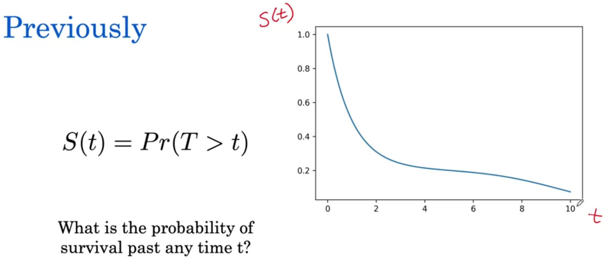
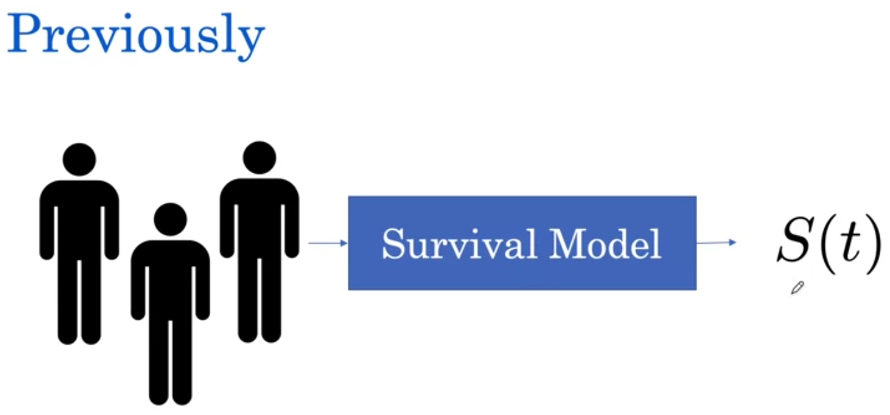
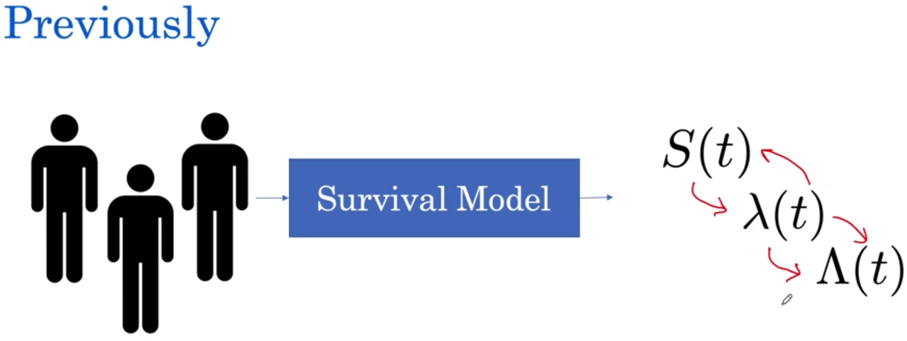
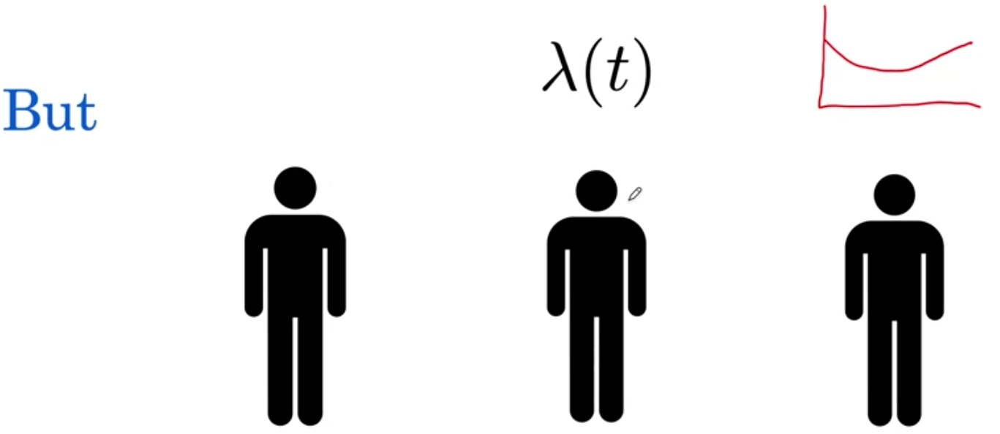
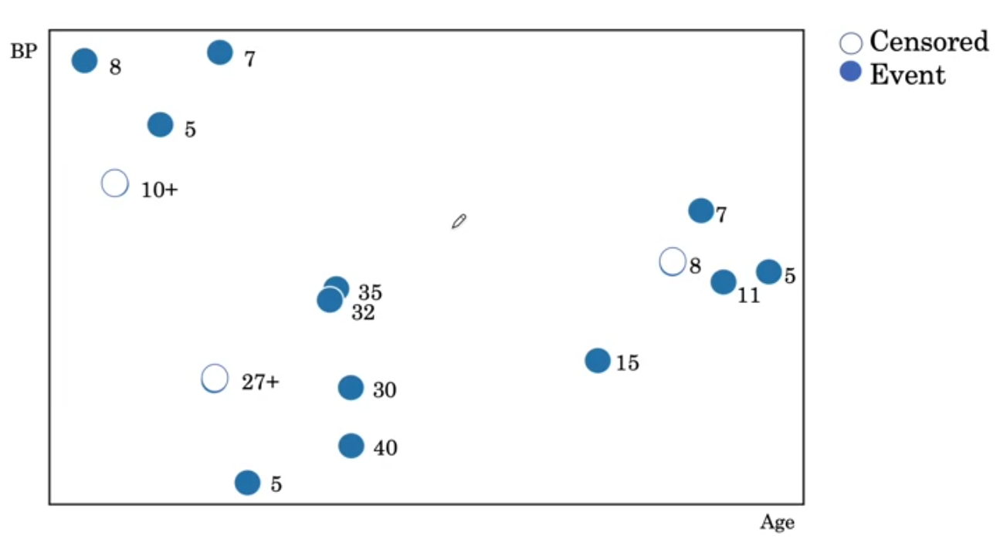
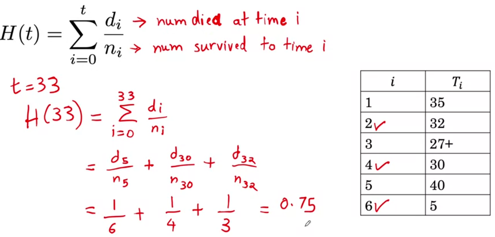
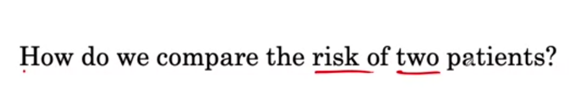

☀ 1. [Hazard Functions](https://github.com/Anacoder1/AI-for-Medicine-Specialization-deeplearning.ai/blob/master/Course%202%20%E2%80%94%20AI%20for%20Medical%20Prognosis/Week%204%20%E2%80%94%20Build%20a%20Risk%20Model%20using%20Linear%20and%20Tree-based%20Models/Week-4%20Notes.md#1-hazard-functions) 

☀ 2. [Hazard](https://github.com/Anacoder1/AI-for-Medicine-Specialization-deeplearning.ai/blob/master/Course%202%20%E2%80%94%20AI%20for%20Medical%20Prognosis/Week%204%20%E2%80%94%20Build%20a%20Risk%20Model%20using%20Linear%20and%20Tree-based%20Models/Week-4%20Notes.md#2-hazard) 

☀ 3. [Survival to Hazard](https://github.com/Anacoder1/AI-for-Medicine-Specialization-deeplearning.ai/blob/master/Course%202%20%E2%80%94%20AI%20for%20Medical%20Prognosis/Week%204%20%E2%80%94%20Build%20a%20Risk%20Model%20using%20Linear%20and%20Tree-based%20Models/Week-4%20Notes.md#3-survival-to-hazard) 

☀ 4. [Cumulative Hazard](https://github.com/Anacoder1/AI-for-Medicine-Specialization-deeplearning.ai/blob/master/Course%202%20%E2%80%94%20AI%20for%20Medical%20Prognosis/Week%204%20%E2%80%94%20Build%20a%20Risk%20Model%20using%20Linear%20and%20Tree-based%20Models/Week-4%20Notes.md#4-cumulative-hazard) 

☀ 5. [Individualized Predictions](https://github.com/Anacoder1/AI-for-Medicine-Specialization-deeplearning.ai/blob/master/Course%202%20%E2%80%94%20AI%20for%20Medical%20Prognosis/Week%204%20%E2%80%94%20Build%20a%20Risk%20Model%20using%20Linear%20and%20Tree-based%20Models/Week-4%20Notes.md#5-individualized-predictions) 

☀ 6. [Relative Risk](https://github.com/Anacoder1/AI-for-Medicine-Specialization-deeplearning.ai/blob/master/Course%202%20%E2%80%94%20AI%20for%20Medical%20Prognosis/Week%204%20%E2%80%94%20Build%20a%20Risk%20Model%20using%20Linear%20and%20Tree-based%20Models/Week-4%20Notes.md#6-relative-risk) 

☀ 7. [Ranking Patients by Risk](https://github.com/Anacoder1/AI-for-Medicine-Specialization-deeplearning.ai/blob/master/Course%202%20%E2%80%94%20AI%20for%20Medical%20Prognosis/Week%204%20%E2%80%94%20Build%20a%20Risk%20Model%20using%20Linear%20and%20Tree-based%20Models/Week-4%20Notes.md#7-ranking-patients-by-risk) 

☀ 8. [Individual vs. Baseline Hazard](https://github.com/Anacoder1/AI-for-Medicine-Specialization-deeplearning.ai/blob/master/Course%202%20%E2%80%94%20AI%20for%20Medical%20Prognosis/Week%204%20%E2%80%94%20Build%20a%20Risk%20Model%20using%20Linear%20and%20Tree-based%20Models/Week-4%20Notes.md#8-individual-vs-baseline-hazard) 

☀ 9. [Smoker vs. Non-Smoker](https://github.com/Anacoder1/AI-for-Medicine-Specialization-deeplearning.ai/blob/master/Course%202%20%E2%80%94%20AI%20for%20Medical%20Prognosis/Week%204%20%E2%80%94%20Build%20a%20Risk%20Model%20using%20Linear%20and%20Tree-based%20Models/Week-4%20Notes.md#9-smoker-vs-non-smoker) 

☀ 10. [Effect of Age on Hazard](https://github.com/Anacoder1/AI-for-Medicine-Specialization-deeplearning.ai/blob/master/Course%202%20%E2%80%94%20AI%20for%20Medical%20Prognosis/Week%204%20%E2%80%94%20Build%20a%20Risk%20Model%20using%20Linear%20and%20Tree-based%20Models/Week-4%20Notes.md#10-effect-of-age-on-hazard) 

☀ 11. [Risk Factor Increase per Unit Increase in a Variable](https://github.com/Anacoder1/AI-for-Medicine-Specialization-deeplearning.ai/blob/master/Course%202%20%E2%80%94%20AI%20for%20Medical%20Prognosis/Week%204%20%E2%80%94%20Build%20a%20Risk%20Model%20using%20Linear%20and%20Tree-based%20Models/Week-4%20Notes.md#11-risk-factor-increase-per-unit-increase-in-a-variable) 

☀ 12. [Risk Factor Increase or Decrease](https://github.com/Anacoder1/AI-for-Medicine-Specialization-deeplearning.ai/blob/master/Course%202%20%E2%80%94%20AI%20for%20Medical%20Prognosis/Week%204%20%E2%80%94%20Build%20a%20Risk%20Model%20using%20Linear%20and%20Tree-based%20Models/Week-4%20Notes.md#12-risk-factor-increase-or-decrease) 

☀ 13. [Introduction to Survival Trees](https://github.com/Anacoder1/AI-for-Medicine-Specialization-deeplearning.ai/blob/master/Course%202%20%E2%80%94%20AI%20for%20Medical%20Prognosis/Week%204%20%E2%80%94%20Build%20a%20Risk%20Model%20using%20Linear%20and%20Tree-based%20Models/Week-4%20Notes.md#13-introduction-to-survival-trees) 

☀ 14. [Survival Tree](https://github.com/Anacoder1/AI-for-Medicine-Specialization-deeplearning.ai/blob/master/Course%202%20%E2%80%94%20AI%20for%20Medical%20Prognosis/Week%204%20%E2%80%94%20Build%20a%20Risk%20Model%20using%20Linear%20and%20Tree-based%20Models/Week-4%20Notes.md#14-survival-tree) 

☀ 15. [Nelson Aalen Estimator](https://github.com/Anacoder1/AI-for-Medicine-Specialization-deeplearning.ai/blob/master/Course%202%20%E2%80%94%20AI%20for%20Medical%20Prognosis/Week%204%20%E2%80%94%20Build%20a%20Risk%20Model%20using%20Linear%20and%20Tree-based%20Models/Week-4%20Notes.md#15-nelson-aalen-estimator) 

☀ 16. [Comparing the Risks of Patients](https://github.com/Anacoder1/AI-for-Medicine-Specialization-deeplearning.ai/blob/master/Course%202%20%E2%80%94%20AI%20for%20Medical%20Prognosis/Week%204%20%E2%80%94%20Build%20a%20Risk%20Model%20using%20Linear%20and%20Tree-based%20Models/Week-4%20Notes.md#16-comparing-the-risks-of-patients) 

☀ 17. [Mortality Score](https://github.com/Anacoder1/AI-for-Medicine-Specialization-deeplearning.ai/blob/master/Course%202%20%E2%80%94%20AI%20for%20Medical%20Prognosis/Week%204%20%E2%80%94%20Build%20a%20Risk%20Model%20using%20Linear%20and%20Tree-based%20Models/Week-4%20Notes.md#17-mortality-score) 

☀ 18. [Evaluation of Survival Models](https://github.com/Anacoder1/AI-for-Medicine-Specialization-deeplearning.ai/blob/master/Course%202%20%E2%80%94%20AI%20for%20Medical%20Prognosis/Week%204%20%E2%80%94%20Build%20a%20Risk%20Model%20using%20Linear%20and%20Tree-based%20Models/Week-4%20Notes.md#18-evaluation-of-survival-models) 

☀ 19. [Permissible and Non-Permissible Pairs](https://github.com/Anacoder1/AI-for-Medicine-Specialization-deeplearning.ai/blob/master/Course%202%20%E2%80%94%20AI%20for%20Medical%20Prognosis/Week%204%20%E2%80%94%20Build%20a%20Risk%20Model%20using%20Linear%20and%20Tree-based%20Models/Week-4%20Notes.md#19-permissible-and-non-permissible-pairs) 

☀ 20. [Possible Permissible Pairs](https://github.com/Anacoder1/AI-for-Medicine-Specialization-deeplearning.ai/blob/master/Course%202%20%E2%80%94%20AI%20for%20Medical%20Prognosis/Week%204%20%E2%80%94%20Build%20a%20Risk%20Model%20using%20Linear%20and%20Tree-based%20Models/Week-4%20Notes.md#20-possible-permissible-pairs) 

☀ 21. [Example of Harrell's C-Index](https://github.com/Anacoder1/AI-for-Medicine-Specialization-deeplearning.ai/blob/master/Course%202%20%E2%80%94%20AI%20for%20Medical%20Prognosis/Week%204%20%E2%80%94%20Build%20a%20Risk%20Model%20using%20Linear%20and%20Tree-based%20Models/Week-4%20Notes.md#21-example-of-harrells-c-index) 

☀ 22. [Example of Concordant Pairs](https://github.com/Anacoder1/AI-for-Medicine-Specialization-deeplearning.ai/blob/master/Course%202%20%E2%80%94%20AI%20for%20Medical%20Prognosis/Week%204%20%E2%80%94%20Build%20a%20Risk%20Model%20using%20Linear%20and%20Tree-based%20Models/Week-4%20Notes.md#22-example-of-concordant-pairs) 

☀ 23. [Week-4 Summary](https://github.com/Anacoder1/AI-for-Medicine-Specialization-deeplearning.ai/blob/master/Course%202%20%E2%80%94%20AI%20for%20Medical%20Prognosis/Week%204%20%E2%80%94%20Build%20a%20Risk%20Model%20using%20Linear%20and%20Tree-based%20Models/Week-4%20Notes.md#23-week-4-summary) 

☀ 24. [Congratulations!](https://github.com/Anacoder1/AI-for-Medicine-Specialization-deeplearning.ai/blob/master/Course%202%20%E2%80%94%20AI%20for%20Medical%20Prognosis/Week%204%20%E2%80%94%20Build%20a%20Risk%20Model%20using%20Linear%20and%20Tree-based%20Models/Week-4%20Notes.md#24-congratulations)  

# 1. Hazard Functions

This week, you will learn about strategies to build and evaluate
Survival Prediction Models that will allow you to compare the
risks of individual patients 

You will learn about 2 such models — the **Cox Proportional
Hazards** and then **Survival Trees** 

Finally, you will learn about **Harrell's C-Index**, which will
`allow you to evaluate the prediction performance of the Survival
Models that you'll build` 

This will be a very exciting week, because it will bring together
concepts you've already learned thus far in the course  

In this lesson, you'll learn about 2 other tools that go
hand-in-hand with the Survival Function, the **Hazard Function**
and the **Cumulative Hazard Function** 

You'll see that the Survival, Hazard, and Cumulative Hazard
functions are all related to each other and can help answer
different questions  

***
 

# 2. Hazard

In this lesson, we'll chat about Hazard 

Thus far, we've looked at Survival Models where we've had the
question, *What is the probability of Survival past any time t?* 

  

To answer this question, we saw the **Survival Function** which
tells us `the probability that the time to an event is after some
time` *t*, and we could represent the Survival Function
graphically, with time on the x-axis, which we'll call *t*, and
on the y-axis,the Survival Probability, *S(t)*, which starts off
at 1 and then goes to 0 as time goes on 

  

But let's say we were interested in a different question, not
what the probability of Survival past any time *t* is, but *what
a patient's immediate risk of death is if they make it to some
time t* 

We might want to know this to understand whether a patient is more
at risk in year 1 or in year 10, and we can use this information
to then inform treatment when the patient is most at risk 

  

So how do we represent a patient's immediate risk of death if
they make it to time *t*? 

  

This is what's called the **Hazard**, and the Hazard is
represented by the Greek letter λ (*small Lambda*) 

The Hazard of *t* is `the probability that the time to an event
is at` *t*, `given it is at or after` *t* 

The interpretation of this is *what is the risk of death if
someone is aged t?*, *What is their immediate risk of death if
they make it to time t?*, and that's what the Hazard is 

  

Like the Survival Function, the Hazard Function can be represented
graphically 

So once again, we have *t* on the x-axis, and now we have *λ(t)*
on the y-axis, and it's telling us as time goes on, what is our
Hazard at that particular time 

Notice from the shape, we can tell what a patient's Hazard is,
what a patient's instantaneous risk of death is at any point in
time — we can see that it's highest at 0, then drops rapidly
to 4, and then increases again to the time of 10 where it's
getting to a similar Hazard as the time of 0 

> 💡 This allows us to see that the patient's risk is high
first, then drops to a low level, and then grows again later 

This is what's called a **bathtub curve**, where `the risk of
death is very high immediately at time 0, then goes down, and
then increases with time` 

This can happen, let's say with *some treatment like surgery*
where the risk of complications immediately might be very high,
then they go down over time, but then the patient's risk
increases as time goes on 

  

***
 

# 3. Survival to Hazard

Now, the `Hazard Function can be actually used to create the
Survival Function`, they're related 

We won't jump too much into their relationship, but all that's
important to understand here is that there is a formula which
allows us to go from Hazard to the Survival 

  

We can use that formula to get the corresponding Survival curve
from the Hazard curve — the Survival curve is on the left, that
corresponds to the Hazard curve on the right 

We see that the Survival curve helps us answer the question,
*what is the probability of Survival past any time t* easily 

For example, if we wanted to know the probability of Survival
past time 4, then we could read off the graph that it's a little
higher than 0.2 

At the same time, we can answer questions like *what is the
patient's immediate risk of death if they make it to time t*
by looking at what the Hazard is at 4, and realizing the Hazard
at time 4 is smaller than the Hazard at time 8, let's say 

  

This relationship is in both directions, so `we can actually
derive the Hazard from the Survival curve as well` 

Once again, we won't worry too much about the actual formula
that gives us their relationship, but you can interpret this
formula as *the Hazard is the rate of death if aged (t)* 

Using this Survival curve, we can generate the corresponding
Hazard curve 

Here, we can see that the Hazard for this patient population
is a constant function and what that means is that the immediate
risk of death given Survival to any time *t* is constant, here
it is 1 

Here's the corresponding Survival curve for that 

  

We've now looked at Survival and Hazard as 2 functions where one
can be used to derive the other and vice-versa 

  

***
 

# 4. Cumulative Hazard

So thus far, we've looked at the probability of Survival past
any time *t* with the Survival Function and we've looked at the
immediate risk of death if a patient makes it to time *t*, and
that's the Hazard 

We'll now look at another question, which is, <code>*what is the
patient's Accumulated Hazard or accumulated risk up to time t?*</code> 

We're going to represent this with the Greek letter Λ (*capital
Lambda*), remember Hazard is small Lambda (λ). So, **Cumulative
Hazard is going to be Λ(t)** 

  

Of course, a patient's Accumulated Hazard up to time *t* is very
related to their Hazard at time *t*, and the relationship we can
write in the following way 

For instance, `Λ(3) = λ(0) + λ(1) + λ(2) + λ(3)` 

So we're summing up all time steps up till time 3 over here, but
the general formulation of this up to time *t* is going to be
the sum from *i* = 0 to *t* of `λ(i)` 

This is saying for any time *t*, I'm looking at all time points
before up to that time *t* and summing them up 

This is the expression that we get when the time can take
discrete values like 0, 1, 2, 3 

We've also seen where time can take on any continuous number
between 0 up to 3 or whatever amount we want 

For that, we have the continuous extension of the Cumulative
Hazard which we write down as the integral from 0 to *t* of
`λ(i)di` 

Don't worry too much about this, all that you need to understand
is the Cumulative Hazard is going to be the sum, and the integral
form is just a way to represent the sum when our time is
continuous 

  

We've seen earlier the Hazard curve that tells us the
`instantaneous risk` on the y-axis and the `time` on the x-axis 

We can use this Hazard curve to tell us what the corresponding
Cumulative Hazard curve is going to look like using the formula
that we saw earlier 

Once again, don't worry too much about what this formula is doing
if you haven't seen integrals before, it's just a way of summing
up the Hazards along the time axis 

  

This is the corresponding Cumulative Hazard that tells us how the
patient's Accumulated risk over time is changing 

  

This is a constant Hazard curve, so we can see that over time the
Hazard isn't changing, and the corresponding Cumulative Hazard
curve for this looks like the following, so you can see the
straight line going up as we're summing over the time dimension
in the Hazard curve 

  

Previously, we've seen that Survival Models can be used to
output a Survival Function... 

  

...but now we know that it can not only be used to output a
Survival Function but also a Hazard Function or Cumulative Hazard
Function, and **we can use any one of these 3 to derive the
others by using some formulae** that allow us to represent that
function in whatever way is most appropriate for whatever
question that we want to answer 

  

***
 

# 5. Individualized Predictions

In this lesson, you'll learn about the **Cox Proportional Hazards
Model** 

You'll learn how the Cox Model can `take into account patient
variables to compare the risk of different patients using their
patient profile`  

So in this video, we'll chat about the Cox Proportional Hazards 

Thus far, we've looked at how for a population of patients, we
can build a Survival Model to estimate quantities like the
***Survival Function***, which tells us the probability of
Survival up to some time *t* 

We can use this Survival Function to also derive a ***Hazard
Function***, which we can also use to derive a ***Cumulative
Hazard Function*** 

We can also directly estimate these quantities and use those
quantities to estimate the other quantities like the Survival
or the Cumulative Hazard 

  

So let's say we come up with a Hazard Function for a patient
population, we're going to have the same Hazard that we apply to
all of the patients within the population — no matter if that's
Patient 1, 2 or 3 

  

But the issue with this is that in reality, these patients look
very different from each other 

> 💡 So, representing their risks with one Hazard Function might
seem like we're not really taking into account their individual
differences, which might inform differences in their Hazard 

For example, if we have a 50-year-old smoker, we might expect the
risk to be very different from a younger patient who's a
non-smoker, who's going to be different from a non-smoker older
patient 

So the next challenge for us is, *can we come up with a Hazard
function that is going to be specific to these patients, like*
<code>λ1(t)</code>, <code>λ2(t)</code>
and <code>λ3(t)</code>? 

  

How do we model the Hazard for an individual patient? 

One way we can do it is the following — we can say the Hazard for
an individual at any time *t* is going to be the **baseline
Hazard** at time *t*, which we're going to represent with
<code>λ0(t)</code>, times some multiplicative factor
(we'll see what this is in a bit) 

So we have our baseline here represented by the `orange line` —
this specifies what the Hazard curve looks like for the population 

Then the function is saying, to get to my individual Hazard,
which is the `red line`, I'm going to multiply this baseline risk
by some factor 

Here we're going to have the factor as 1.35 and use that to
multiply the orange curve by 1.35 to get our individual estimate
for the Hazard 

  

Why is this individual? 

The reason this is individual is because our factor is going to
be determined by patient variables 

Here, the patient variables that we're going to use are going to
be whether the patient `is a smoker` and what their `age` is 

  

***
 

# 6. Relative Risk

This is very similar to a linear model where we have variables
and those are multiplied by weights and then they are summed up
together 

The one difference here is, we're then taking the exponent of
that 

> 💡 It's not very important to understand why we're taking the
exponent of that except that this `helps make sure the output is
always greater than or equal to zero`, and we can then multiply
that by the Baseline Hazard 

  

We can use this model of the Hazard to determine what are the
Relative Risks of patients 

  

For example, if we had 2 patients Patient 1 and Patient 2;
Patient 1 had the following characteristics — they were
50-years-old and they smoked & Patient 2 was 30 and they did not
smoke 

Then can we compare the Relative Risk of Patient 1, represented
by <code>λ1(t)</code>, with the Relative Risk of
Patient 2, <code>λ2(t)</code> 

Let's try to compute what that risk would be given this model  

Patient 1 is a smoker, so `is_smoker` = 1, and their `age` = 50 

<code>λ1(t)</code> = <code>λ0(t)</code> x exp(0.08 x 1 + 0.01 x 50) 

<code>λ1(t)</code> = <code>λ0(t)</code> x exp(0.58) 

<code>λ1(t)</code> = <code>λ0(t)</code> x 1.79  

Patient 2 is a non-smoker, so `is_smoker` = 0, and their `age` = 30 

<code>λ2(t)</code> = <code>λ0(t)</code> x exp(0.08 x 0 + 0.01 x 30) 

<code>λ2(t)</code> = <code>λ0(t)</code> x exp(0.3) 

<code>λ2(t)</code> = <code>λ0(t)</code> x 1.35  

So there we have computed the risks for Patient 1 and Patient 2 

  

***
 

# 7. Ranking Patients by Risk

Now that we have the Hazard for both Patient 1 and Patient 2,
we can compare the two 

Note that for both of them, they have their representations
in terms of the Baseline Hazard 

<code>λ1(t)</code> = <code>λ0(t)</code> x
1.79 — Hazard for Patient 1 is the Baseline Hazard times 1.79 

<code>λ2(t)</code> = <code>λ0(t)</code> x
1.35 — Hazard for Patient 2 is the Baseline Hazard times 1.35 

We know that the Hazard is always ≥ 0, which means
<code>λ1(t)</code> and <code>λ2(t)</code>
will always be positive numbers 

Because the factor on Patient 1 is higher, this means that Patient
1 always has at least as much risk as Patient 2, if not higher at
every time point 

  

We can now compute the Hazard for some new Patient 3
(50-years-old, non-smoker) 

For this patient, we can compute their risk as 

<code>λ3(t)</code> = <code>λ0(t)</code> x exp(0.08 x 0 + 0.01 x 50) 

<code>λ3(t)</code> = <code>λ0(t)</code> x exp(0.05) 

<code>λ3(t)</code> = <code>λ0(t)</code> x 1.65 

  

Now that we've computed the Hazard for all 3 patients, we can
actually compare the risk between them 

Here we see that the factor associated with the 50-year-old
smoker is high, followed by the 50-year-old non-smoker, followed
by the 30-year-old non-smoker 

So we can create a rank that says Patient 1 has a higher risk
than Patient 3, who has a higher risk than Patient 2 

  

***
 

# 8. Individual vs. Baseline Hazard

So we saw the Cox Proportional Hazards Model where we have the
Baseline Hazard times some factor that is determined by the
patient covariates 

One thing to note here is, let's see what happens when all our
covariates, all our variables are equal to 0 

So we have this expression evaluate to... 

<code>λ(t)</code> = <code>λ0(t)</code> x exp(0.08 x 0 + 0.01 x 0) 

<code>λ(t)</code> = <code>λ0(t)</code> x exp(0) 

<code>λ(t)</code> = <code>λ0(t)</code> x 1 

> 💡 ...and so the Hazard for a patient is the same as the
Baseline Hazard if all of the variables are equal to 0 

Now of course, we won't have any patient whose `age` = 0 and is a
non-smoker, usually our age will be larger than 0, but this tells
us what the Hazard would look like when we have a factor
of 1 that's coming from the patient covariates 

  

The cool thing about this model is that `the Baseline Hazard
doesn't have to be specified, so it can take on any shape` 

For example, here we have 2 graphs showing 2 different Baseline
Hazards, and a patient who has the Baseline Hazard times a risk
factor of 1.35 

So on the left we have a constant Baseline Hazard, and we can
see the patient in red who is at every time point 1.35 times
that 

You can see on the right where we have a **bathtub curve Hazard**,
how the Baseline Hazard sits below the patient Hazard, which is
1.35 times the risk at every time point 

  

***
 

# 9. Smoker vs. Non-Smoker

So let's say we want to compare a smoker to a non-smoker 

First, let's compute the Hazard for a smoker 

[Let's see what happens if we just leave the `age` unspecified] 

<code>λsmoker(t)</code> /  = <code>λ0(t)</code> x exp(0.08 x 1 + 0.01 x age) 

Similarly, the Hazard for a non-smoker 

<code>λnon-smoker(t)</code> = <code>λ0(t)</code> x exp(0.08 x 0 + 0.01 x age)  

Now let's look at how much riskier a smoker is compared to a
non-smoker by saying what is the ratio of their risk 

<code>λsmoker(t)</code> / <code>λnon-smoker(t)</code> = <code>λ0(t)</code> x exp(0.08 + 0.01 x age) / <code>λ0(t)</code> x exp(0.01 x age) 

<code>λsmoker(t)</code> / <code>λnon-smoker(t)</code> = exp(0.08 + 0.01 x age) / exp(0.01 x age) 

What we're going to do with the term in the numerator is we're
going to express it as the product of 2 exponents, so that way
we'll simplify it 

<code>λsmoker(t)</code> / <code>λnon-smoker(t)</code> = exp(0.08) x exp(0.01 x age) / exp(0.01 x age) 

[This is because the addition in the exponent term is going to
be the product of exponents here] 

This becomes.. 

<code>λsmoker(t)</code> / <code>λnon-smoker(t)</code> = exp(0.08) 

This is coming out to simply the exponent of 0.08, which is
going to be `1.08` 

  

So here we've found the ratio of the Risk of a smoker to a
non-smoker without making any asusmptions about their `age`
because the `age` terms cancel off, and so do the Baseline
terms 

So we don't even have to specify the Baseline  

***
 

# 10. Effect of Age on Hazard

We can apply the same principle to the `age` term and we can
ask the question, *how much more risky is being a certain age
compared to a different age?* 

Now unlike `is-smoker`, which can only take on the values of 0
and 1, `age` can take on a continuous range of values, here
we'll look at how much more risky is being 51 compared to 50 

  

So we'll apply the same principles again 

[Let's not specify this time whether a person is a smoker] 

<code>λ51(t)</code> = <code>λ0(t)</code> x exp(0.08 x is-smoker + 0.01 x 51) 

<code>λ50(t)</code> = <code>λ0(t)</code> x exp(0.08 x is-smoker + 0.01 x 50) 

Now we take the ratio between the two, we'll simplify the
addition terms within the exponent term directly 

<code>λ51(t)</code> / <code>λ50(t)</code> = [<code>λ0(t)</code> x exp(0.08 x is-smoker) x exp(0.01 x 51)] / [<code>λ0(t)</code> x exp(0.08 x is-smoker) x exp(0.01 x 50)] 

<code>λ51(t)</code> / <code>λ50(t)</code> = exp(0.01 x 51) / exp(0.01 x 50)  

What we can do here is because this is a division of exponents,
we can subtract them in the exponent 

<code>λ51(t)</code> / <code>λ50(t)</code> = exp(0.01 x 51 - 0.01 x 50)  

<code>λ51(t)</code> / <code>λ50(t)</code> = exp(0.01)  

<code>λ51(t)</code> / <code>λ50(t)</code> = 1.01  

  

So if we take the ratio of the Risks of a 51-year-old to a
50-year-old, we have a `Risk ratio of 1.01`  

***
 

# 11. Risk Factor Increase per Unit Increase in a Variable

Here's something interesting to notice 

✅ When we looked at the ratio of a smoker to a non-smoker, we had
the ratio of `1.08` and I've just rearranged the terms here to say
the risk for a smoker is 1.08 times the risk for a non-smoker 

✅ Similarly, when we looked at `age`, when we looked at 51-year-
old vs. 50-year-old, we had the Hazard for the 51-year-old as
`1.01` times the Hazard for the 50-year-old 

Now, these terms 1.08 and 1.01 are simply the exponent of the
weights that are attached to those variables 

So with the `is-smoker` variable, we have 0.08 and we have 1.08
as the Risk ratio between the smoker and the non-smoker 

Similarly, we have 0.01 as the weight associated with the `age`
term and for that we have the risk increase be 1.01 from 50 to
51 

> 💡 What we can tell from our calculations over here is that
***the exponent of the weight is actually the Risk factor
increase for a unit increase in the variable*** 

What this meant for `is-smoker` was going from 0 to 1, that was a
unit increase in that variable, for `age` it meant going from 50
to 51, but that could have been 40 to 41 or 42 to 43 and the
result would have been the same — the Hazard ratio of a person
who's 43-years-old is going to be 1.01 times the Hazard of a
person who is 42-years-old 

  

***
 

# 12. Risk Factor Increase or Decrease

We've seen an example of the ***Cox Proportional Hazards model***
where we looked at patient variables like whether they're a
smoker and what their age is 

We multiply each of these variables by a weight 

We can come up with a more general form of this expression where
we can call these ***Betas*** 

β1 = 0.08; β2 = 0.01 

We can call the variables ***X-es*** 

X1 = `is_smoker`; X2 = `age` 

Now of course, a patient might have more than 2 variables, so the
more general form of this expression is.. 

<code>λ(t)</code> = <code>λ0(t)</code> x exp(β1X1 + β2X2 + ...) 

<code>λ(t)</code> = <code>λ0(t)</code> x exp(Σi βiXi)  

Now we've also seen factor increases in the Risk by a unit
increase in the variables 

We saw that if we have a variable Xi, then if we
looked at the weight associated with it, βi, and we
take the exponent of that weight, then that represents the
factor Risk increase when we have Xi become
Xi + 1 

So it tells us what the increase is in the factor Risk when we
have a unit increase in our variable 

We saw 2 examples of this with `age` and with `is_smoker`, where
increasing `is_smoker` from 0 to 1 increased the risk by a factor
of 1.08, and increasing the `age` from any age *n* to *n+1*
increased the factor Risk by 1.01 

> 💡 One thing worth noticing here is that when our exponent of
βi > 1, the Risk factor increases, but when our
exponent of βi < 1, the factor Risk decreases 

So if we have <code>exp(βi) < 1</code> going on, it
means our variable Xi is actually reducing Risk 

  

Let's look at that with an example 

Here we have 4 patient variables — `Age`, `HDL` (HDL
cholesterol), `Treatment`, and `Is_smoker` 

So we have our Cox Proportional Hazards model with the following
weight attached to these variables 

Now we can take the exponent of those weights to get the factor
Risk increase associated with that variable 

We can see that increasing `Age` from let's say 50 to 51, or
whatever unit increase this can be, would increase the Risk by a
factor of `1.14` 

That is, <code>λ51(t)</code> = <code>λ50(t)</code> x 1.14 

For `HDL` we have a negative weight and when we take the exponent
of that, the result is smaller than 1 (*0.93*), so this is
actually decreasing Risk 

For `Treatment`, we see the same thing where our weight is
negative, and so the exponent of that weight is going to be < 1,
here *0.82* 

Therefore, having treatment or having a high HDL is actually
reducing the Risk for that patient 

Finally, we have `Is_smoker` which like we've seen before has a
positive weight associated with it, so it's increasing the Risk
by a factor of *1.09* 

  

***
 

# 13. Introduction to Survival Trees

In this lesson, you'll learn about **Survival Trees** 

You'll see how Survival Trees `can take patient variables into
account to compare the risks of different patients` 

You'll see that Survival Trees are like binary ***Decision
Trees*** that you've already seen before, and can allow you to
build models that capture non-linear relationships in patient
data  

In this lesson, we'll chat about Survival Trees 

So, previously we've looked at Survival Models where we were
able to come up with Hazard Functions that were not just for all
of the population, but were actually individualized such that one
patient got one Hazard Function, and another patient got another
Hazard Function 

  

> 💡 One of the key things about these Hazard Functions that we
saw was `that they were proportional to each other in terms of
Risk` — we could represent one Hazard as a factor that was
multiplying another Hazard 

We can see this when we see the formula where we have the Hazard
for some patient as the Baseline Hazard times a factor, which is
determined by their variables 

We saw here the variables of `age` and `is_smoker` (whether
they were a smoker) being multiplied by the weight associated
with those variables 

  

Let's look at this expression a little more carefully 

So we have the Hazard be the Baseline Hazard times this factor
that's determined by the patient's variables, and let's look at
what this is doing 

This is saying that as `age` increases, the Risk is increasing as
well, because remember, this is a positive term, and the exponent
of a positive term is going to be > 1 

But let's say we had a case in which it was riskier to be really
young than it was to be middle-aged, and then it was riskier to
be old than middle-aged 

⚠ We can see that we won't be able to capture this relationship
with a linear function of `age`, because a linear function of
`age` can only model risk going up or going down, you cannot
model it coming down and then going up 

So that's **one of the disadvantages with having a linear function
and thus the Cox Proportional Hazards Model** 

  

⚠ Another disadvantage of the Cox Proportional Hazards Model is
that `the Hazard Function for 2 patients is always proportional
to each other` 

This means we make the assumption that the shape of the Risks for
similar patients looks the same 

  

However, it's possible that patients might have very different
Risk curves over time 

For instance, let's say we were looking at patients who receive
a treatment like **chemotherapy** 

Now, for chemotherapy, let's make the assumption that we can have
a `high dose` of chemotherapy or `low dose` of chemotherapy 

If we have a high dose of chemotherapy, then we can expect that
the Risk immediately after treatment is very high, but the
long-term Risk is lower 

While, with a lower dose at the start, the immediate harm or Risk
is lower, but then the long-term Risk is higher 

So this is not something we'd be able to represent with the Cox
Proportional Hazards Model, because there, these 2 curves should
always have the same Risk factor difference, while here we can
clearly see that they're crossing, so the Risk factor difference
is not constant, in fact it's switching as time goes on 

  

So, our goal to be able to get around this should be that if we
have a population consisting of patients, then we **should come up
with Hazard Functions that look different for different types of
people within that population** 

And when we talk about Hazard Functions, remember that the
Hazard Function can be used to get a Cumulative Hazard Function,
which can be used to get a Survival Function and vice-versa 

So we have this goal in mind that we want to hit 

For the purposes of this video, we'll look at the Cumulative
Hazard Function as one of the things that we want to model 

 

  

***
 

# 14. Survival Tree

So let's see exactly how this can happen with an example 

Let's say we're looking at a population of patients where we're
looking at the variables `BP` on the y-axis, and
`Age` on x-axis 

So we get data where we can see 3 groups distinctly popping out 

We have a group of patients who have a high `Age` 
We have a group of patients who have a high `BP` and are young 
And we have a group of patients who have low `BP` and low `Age` 

Notice that each of these points which represents a patient,
is also annotated with their *Survival time*, & if they're a
***Censored observation*** then we have a `white point`, if there
is an event at the given time then we have a `blue color` to
represent that 

Let's say we wanted to split up this population into patients
that look similar to each other such that they had a similar
Survival time 

Notice that everyone with [high `BP` & low `Age`] seems to have a Survival time that's fairly low compared to [low `BP` & low `Age`]
where the Survival time seems to be higher (*we've got numbers in
30s and 40s*) & then again here [high `Age`] we've got Survival
times that are small 

  

We can try to come up with a manual classification which
separates out these groups of patients 

We can say **first rule** that we're going to make is that if the
`Age` is beyond a certain threshold, let's say this one, then
we'll separate out the 2 groups 

Now, to separate out the 2 groups on the left, we're going to say
if `BP` then is beyond a certain threshold, then we're going to
have a different group 

Let's say for the top-left group we're going to estimate the
Cumulative Hazard, let's call this group *(a)*, <code>Λa(t)</code> 

We'll call the bottom-left group *(b)*, we'll estimate the
Cumulative Hazard for group *b*, <code>Λb(t)</code> 

For the right-most group, we'll call it group *(c)*, and its
Cumulative Hazard is <code>Λc(t)</code> 

  

This might look very similar to a **Decision Tree**, because
that's exactly what it is 

This Decision Tree that we came up with can be represented in
this tree structure which says, is your `Age` ≥ 60, if it is then
you're in group *(c)* and we're going to build an estimate of the
Cumulative Hazard 

If `Age` < 60, let's look at the `BP`, if the `BP` < 160 then the
patient is a part of group *(b)*, and we'll use the Cumulative
Hazard for group *(b)* 

If the `BP` ≥ 160, then we'll use the Cumulative Hazard for group
*(a)* 

  

We've seen Decision Trees before in an earlier module, let's just
look at how they looked 

So remember that earlier we had a Decision Tree where we were
trying to classify whether someone had a risk of heart disease
or mortality, and we saw that we could build these lines that
could classify patients such that they were in the appropriate
Risk category where we had `low Risk` and `high Risk` categories
that we came up with as part of our Decision Tree 

  

There are a couple of key differences here 

The first one of them is that **we're now dealing with the Time
to Event model** where we're not just saying whether something is
`low risk` or `high risk`, we're ***actually saying what the risk
is at every point in time*** 

Remember we can represent the risk at every point in time with
<code>λ(t)</code>, or we can represent it with the Cumulative
Hazard <code>Λ(t)</code> or with the Survival Function `S(t)`
because recall that they're interchangeable 

In this particular case we focus on Cumulative Hazard 

The second difference is that **we're now dealing with Survival
Data**, so these patients are not just colored like they were
before with red or blue which represented whether they died or
lived in ten years, but with ***the Survival time*** 

So we have Survival time of 7, and let's say the units was
*years*, we have a censoring time of 10+ years, this is **another
key difference with Survival Data where we have censored
observations** 

  

When we have a new patient that comes in, this one with `Age` =
52 and `BP` = 132, we can determine which Hazard to use to
estimate their Risk by seeing where they would fall 

So `Age` < 60 and then the `BP` < 160, so we know that they would
fall into group *(b)*, then we would estimate their Cumulative
Hazard at every point in time *t*, with our Cumulative Hazard
estimate for group *(b)* 

  

***
 

# 15. Nelson Aalen Estimator

Let's talk about `how we can actually estimate the Cumulative
Hazard for this group once we've gone to the group` 

We can represent each of these data points in the form of a
Survival table, which we have seen before, where we have a set of
patients, here we have 6 patients, and for each of them we write
the outcome which is the ***event times*** or the ***censoring
times*** 

Here we can see that we have 1 censored observation which we
write as *27+*, and we have 5 non-censored observations for which
we write the event times 

  

Once we have a table of this form, we've seen how we can use
Survival estimation with the **Kaplan Meier method** to come up
with a Survival Function that uses this data 

The Kaplan Meier Estimator is not the only Estimator we can use 

One other estimator, the **Nelson Aalen Estimator** allows us to
estimate the Cumulative Hazard of the population instead 

We won't go into the derivation of this, we'll go through an
example of generating a Cumulative Hazard estimate for a
population 

  

Here we have once again the formula for the Cumulative Hazard
and we have the table with the data that we'll use to estimate
the Cumulative Hazard 

Let's look at this expression in a little more detail 

We have the sum from *i* = 0 to *t* of <code>di/ni</code> 

The definitions of <code>di</code> and <code>ni</
sub></code> are the same as before — as a reminder,
<code>di</code> is the number that died at time *i*,
and <code>ni</code> is the number that survived to
time *i* 

These are the quantities that we have seen previously when we
looked at the Hazard, and remember that the Cumulative Hazard
is the sum of the Hazards over time  

Let's say we wanted to look at the Cumulative Hazard for some
time, let's pick that time to be 33 for the purposes of this
example 

Let's try to estimate the Cumulative Hazard at 33 using the
Nelson Aalen Estimator 

So we have the sum from *i* = 0 to 33 of
<code>di/ni</code> 

<code>di</code> is looking at the number of patients
who have died at every point in time 

When we look at our data, let's look at where the deaths occur,
let's specifically look at where the deaths occur between 0 and
33 

The first patient has a death occurring after 33 so we won't
look at that,  `Patient 2` has a death before 33 so we'll
have to look at that;  Patient 3 is censored before 33, but
that is not a death or event;  `Patient `4 has an event
before 33;  Patient 5 does not have an event before 33; 
`Patient 6` has an event before 33 

So there are 3 time points that we're going to care about which
are going to have a numerator that is non-zero 

Let's look at this sum — now we have the sum from 0 to 33 of
<code>di/ni</code>, but we know that
<code>di</code> is only non-zero for these 3 event
times, so we can represent the sum as first
<code>d5/n5</code> (because our first
event is at 5), then <code>d30/n30</code>,
then <code>d32/n32</code> 

Let's compute each of these quantities  

<code>d5</code> is the number that died at time 5,
which is going to be 1, and <code>n5</code> is the
number that survived to time 5, we can see all 6 patients
survive to time 5, thus <code>d5/n5</code> = `1/6`  

Then we have <code>d30</code> so we look at how many
patients survive to 30 — Patient 1, Patient 2, not Patient 3
(we don't know whether they survived to 30), Patient 4 (even
though they died at 30 we still include them because Survival
is defined as up to that point in time), and finally Patient 5 

So we have 4 in total that survive to 30 and 1 who has an event,
thus <code>d30/n30</code> = `1/4` 

Finally we have <code>d32</code> which is going to be
1 again and <code>n32</code> which is the number of
patients that have survived to 32 — Patients 1, 2 and 5 — so
we have 3 in our denominator, thus
<code>d32/n32</code> = `1/3` 

So we have these 3 quantities which we can sum to get a total
sum of `0.75` 

**0.75 is our estimate of the Cumulative Hazard at time = 33**,
of course our time could be any quantity between 0 and infinity
and we can get our Cumulative Hazard estimate for any of that 

  

***
 

# 16. Comparing the Risks of Patients

Let's chat about how we can compare the Risk of 2 patients 

  

So let's say we have 2 patients — one with `Age` = 50 and `BP`
= 162 & the other with an `Age` = 61 and `BP` = 140 

We can use the Survival Tree to first find out the group that
they belong to 

We see for the first patient, their `Age` < 60 and `BP` > 160,
so they belong to Group *(a)* 

For the second patient, their `Age` > 60, so we see that they
belong to Group *(c)* 

So for the first patient, we would use the Cumulative Hazard
for Group *(a)* to estimate this patient's Cumulative Hazard,
<code>Λa(t)</code> 

And here we would use the Cumulative Hazard for Group *(c)*,
<code>Λc(t)</code> to estimate Patient 2's Cumulative
Hazard 

  

So, we can graph these Cumulative Hazards for both the patients
with the `blue` and `orange` curves here 

We can see at all time points the Cumulative Hazard for the
`blue` patient is higher than the Cumulative Hazard for the
`orange` patient 

This is great because we can say that for all time points, the
`blue` patient has the higher Cumulative Hazard 

  

But what do we do when we have Cumulative Hazards that are
crossing such that for time points below some point, the `blue`
patient has the higher Cumulative Hazard, while the `orange`
patient has a higher Cumulative Hazard beyond that time point? 

To be able to tell which one of them is more at Risk, **we have
to know what time we care about comparing the Cumulative Hazard
of the two** 

  

***
 

# 17. Mortality Score

The key idea we'll use is that **we care about comparing the
Cumulative Hazard at the times where we observe deaths in the
population** 

Let's say we have a population consisting of many patients,
which these 2 patients belong in, and in this population we get
to observe the event times or the Censoring times 

Here, we see that a lot of events take place between 20 and 33,
so we might expect that in this region we care about comparing
the Risks of the 2 patients, which would say that the patient
in `orange` has the higher Risk 

  

Let's try to formalize this 

So we have here, the 4 event times in the dataset, let's assume
we have a population of 5 right now just for simplicity, and of
these 5, we have 4 events — those 4 event times are given by
these vertical lines here 

At these 4 event times, we see that the `orange` curve is always
higher than the `blue` curve, so the `orange` patient always has
the greater Risk 

  

In general, we can compare the Risk of 2 patients, or the
Cumulative Hazard of 2 patients by looking at what they evaluate
to at the different event times in the dataset 

For example, for the first patient which belongs in Group *(a)*,
we can evaluate the Cumulative Hazard at 20, 25, 30 and 33 using
the `orange` curve here 

We can do the same using this patient who belongs to Group *(c)*,
and we can get their Cumulative Hazard at 20, 25, 30 and 33 

Notice that we're not using this patient (*has a Censoring time
of 25+*) here, because we don't observe their event time, we
just observe their Censoring time 

  

Now that we have these 8 numbers, what we can do is sum up each
of these columns to arrive at what's called a **Mortality Score** 

The Mortality Score is `a single value that allows us to compare
the Risks of 2 patients, or rather their Cumulative Hazard
functions where it matters, which is the event times` 

This allows us to say that for Patient A, their Cumulative Hazard
is higher than for this patient that belongs in Group C, and
thus we're able to compare the Risks of 2 patients 

  

***
 

# 18. Evaluation of Survival Models

In this lesson, you'll learn about the **Harrell's Concordance
Index** to `evaluate the performance of Survival Models` 

You've already worked with and calculated the regular Concordance
Index before 

You'll learn how this calculation can be modified when you're
working with Survival Data 

This final tool will allow you to evaluate the Survival Models
you've now learned about  

In this lesson, we'll chat about the evaluation of Survival
Models with the Harrell's C-Index 

  

We've already seen the setup of evaluating a Prognostic Model,
we asked how good a Prognostic Model was earlier when we were
looking at a setup where we had a Risk of death within 10 years,
where we were looking at **Cardiovascular Disease Risk
prediction in 10 years** 

There we had outcomes of *Yes* or *No* for death within 10 years
and we had a Model output a Risk Score 

We saw the C-Index, which looked at pairwise comparisons and
looked at how many of the pairs were concordant, how many of them
were tied and divided by the total number of Permissible Pairs
in those pairwise comparisons 

  

Survival Models have `2 main differences` to the setups we have
seen earlier 

The **first difference** is that the Ground Truth, the thing
we're caring about modeling is the `Time to the Event`, and
we'll call that *(T)*, where for patients we have a time to an
event like 30 months in this example 

The **second key difference** that we have with Survival Models
in our data is that we have `Censored observations`, and we need
to think about in our evaluations how we can handle these
Censored observations as well 

  

First, let's look at the idea of Concordance again 

**Concordance** was the idea that `the patient with the worst
outcome should have a higher Risk Score` 

Now, we can think about in Time to Event problems, what does
worse outcome mean? 

We can see that a worse outcome would be if a patient had an
event earlier, for example if this patient had an event at time
20 months and this patient had an event at time 40 months, the
worst outcome was for the patient who lived a shorter amount of
time, and so for the first patient we should have a higher Risk
Score 

So this would be a Concordant pair because it does follow this
rule 

  

But let's look at what happens when our Time to Event is the
same 

Now, we'd want an ideal Risk Score to say that the Risks for
both of them is the same 

So this would be another case which we would now call
***Concordant*** 

  

Let's say we had 2 Time to Events that were different, but the
worse outcome was for one who got the lower Risk Score, that's
the problem 

So this is a ***Not Concordant*** pair 

  

Here's an example of a ***Risk Tie***, where we have `2 different
Time to Events, but we have the same Risk Score` 

If we have the same Risk Score for 2 patients who had a different
Time to Event, this would be an example of a *Risk Tie* for
those patients 

  

This is also an example of a *Risk Tie* where we have 2 patients
with the same Time to Event where we're saying that the Risk
Score for one of them is smaller than for the other 

Here, we don't want to fully reward the Risk Model because the
Time to Events were the same, so ideally we should have had the
same Risk Score, but it's not entirely wrong either, so we'll
call this a *Risk Tie* 

  

***
 

# 19. Permissible and Non-Permissible Pairs

Recall that **Permissible Pairs** were `pairs where earlier we
had patients with different outcomes, one get a zero, one get a
one` and we're going to extend this idea to Survival Data now 

  

Here's an example of a Permissible Pair, where we have 2 patients
with the same Time to an Event 

Now, earlier, remember when both patients were one and one in
the binary setup or zero and zero, we said that was not a
Permissible Pair 

But this does not hold true when extended to Survival Data 

> 💡 If we have 2 Time to Events with the same time, we still
consider it a Permissible Pair when we're looking at Survival
Data 

  

Let's look at the following example 

Now we have our first Censored observation, and this is *40+*,
so we know that until 40 this patient did not have an event, but
they had one after 

So now can we really make a comparison between who had the worst
outcome here? 

Turns out we can, because let's think about what's happening
here, we have Patient A and Patient B and let's say we were
drawing a timeline of what was happening to the patients, let's
say this extended up to 20, and then this extended up to 40, and
then it was Censored 

I'm going to `denote Censored by an empty circle` over here, and
notice that Patient A clearly had the worst outcome because B
outlived A, even though we didn't see when they had an event,
if they had an event at all, we know that their outcome was
certainly better 

  

Compare that to the following — now we have once again Patient
A and Patient B, but Patient A is the one who's Censored with a
Censoring time of *20+* 

Drawing the same again, we have a Censoring here and we have an
event at 40 

Now for A, we don't know whether they lived to beyond 40 or
before 40, so we're not able to make this comparison 

  

Here we have 2 patients who both have Censored times and again,
we're not able to make this comparison of who has the worst
outcome because that could be either one of the patients, it
doesn't matter even if they have the same Censoring time, we're
still not able to make this comparison 

  

***
 

# 20. Possible Permissible Pairs

Let's look at a picture of the **Permissible Pair**
possibilities 

The first pair has both patients having an event and the length
of the line is the Event time 

We can see here we're able to make comparison of who has the
worst outcome; in the second pair, the Patient who has the event
has the worst outcome 

In the third pair, the Patient who has an event must have the
worst outcome because the other patient, who is Censored,
survived beyond that time, they didn't have an event up to or
until that point 

Finally, if a pair of patients have an event at the same time,
we in our definition call it a Permissible Pair because we're
evaluating whether we have a model give them the same Risk Score 

  

On the other side, we have **Non-Permissible Pairs** and here we
can see if one of the patients was Censored before the other had
the event, then we're not able to make that comparison 

If both had a Censored Time that was equivalent, we still can't
make a comparison, and even if their Censored times were
different, we're not able to make a comparison 

  

With that in mind, we come to the **Harrell's C-Index**, where
we have for every Permissible Pair that is Concordant a Score of
+1 and a Score of 0.5 for a Permissible Pair that is a *Risk
Tie* 

Our formula of the C-Index stays the same with a slightly
different definition of what it means to be a Concordant Pair,
what it means to be a *Risk Tie*, and what it means to be a
Permissible Pair with Survival Data, but we can apply the same
principle and the same formula to our new Survival Models 

  

***
 

# 21. Example of Harrell's C-Index

Now, let's look at an example where we have a set of patients
and let's try to compute the **Harrell's C-Index** for this
particular Risk Model 

Notice that all of these Risk Scores are scalars and we can ask
where did these come from? 

Well, if we have a **Cox Proportional Hazards Model**, remember
that we had come up with Risks such as <code>0.65λ0(t)</code>,
and that could be this number over here (*0.65*) 

Also, when we looked at **Survival Trees**, we looked at the *M*,
where we summed over the Cumulative Hazards for a population and
so when we did that sum, that led to a scalar as well and so
this could come from either the Mortality for a Survival Tree or
from the Scale factor for the Cox Proportional Hazards Model 

But we have this Risk Model which outputs these Risk Scores,
let's look at how we can evaluate how good of a Model this is on
this data 

  

Our first step is going to be to look at the Permissible Pairs
in this population, so let's first try to find which of these
Pairs are Permissible 

In the pair (A, B), we have the Censoring occur before the Event
time, so this is a case where we're not able to compare the
outcomes, so this isn't a Permissible Pair 

In the pair `(A, C)`, we can see the Event Time here is happening
before, so this is going to be a Permissible Pair 

In the pair (A, D), both of these times are Censored so we won't
be able to make this comparison 

In the pair `(A, E)`, we have an Event occur before an
observation is Censored, so this is also a valid Permissible
Pair 

In the pair `(B, C)`, both of these are Events, so we can
definitely compare them — Permissible Pair 

In the pair (B, D), we can see that the Censoring is happening
before the event so this is not going to be a Permissible
Pair 

In the pair `(B, E)`, both of them are Events, so that's
certainly a Permissible Pair 

In the pair `(C, D)`, we have 1 Event but we know one of them
was Censored at the time, thus we know that they didn't have an
Event up to or at that time so we know that the worst outcome
was for C, so this is a Permissible Pair 

Notice that so far we've only looked at the *(T)* column, we're
not looking at the *(Risk)* column at all because we don't need
the *(Risk)* column when we're determining whether a Pair is
Permissible 

In the pair `(C, E)`, both of them are Events, so this is a
Permissible Pair 

In the pair (D, E), for D, the Censoring is happening before the
Event Time, so we won't be able to compare the two 

So, we have **6 Permissible Pairs** 

  

***
 

# 22. Example of Concordant Pairs

Now, let's look at our Concordant Pairs 

Notice `when we're looking at Concordant Pairs, we only have to
look at the Pairs that were Permissible`, because only the
Permissible Pairs are comparable and so now we'll see Concordance 

Remember, Concordance says, **does the patient with the worst
outcome have the higher Risk Score?** 

Let's try to determine whether that's the case 

For the pair `(A, C)`, we have the Risk as 0.65 and 0.7, & the
worst outcome was for Patient C, thus (A, C) is Concordant 

For the pair `(A, E)`, the worst outcome was for E and E had the
higher Risk Score, so (A, E) is also going to be a Concordant
Pair 

For the pair (B, C), we have both of them Events and a higher
Risk assigned to B, but B has the longer Survival Time, so this
is not a Concordant Pair 

For the pair (B, E), we have the higher Risk assigned to B but
B has the longer Survival Time, so that is also not a Concordant
Pair 

For the pair `(C, D)`, we have the worst outcome for C and C has
the higher Risk, so this is going to be a Concordant Pair 

For the pair (C, E), the worst outcome is for C and the higher
Risk is for E, so this is not a Concordant Pair  

Let's look at whether we have any Ties 

We don't have any ties because we have been through all of the
Pairs at this point, so here we're just going to write `None`  

Remember our formula for the C-Index is going to be the number
of Concordant Pairs (3) + (0.5 x the number of *Risk Ties* (0)),
& our denominator is going to have the number of Permissible
Pairs (6) 

So, we have our **C-Index** of 3/6, which is equal to `0.5` 

  

***
 

# 23. Week-4 Summary

Congratulations on completing the last week for this course! 

This week, you learned how you could build and evaluate Models
for Survival Prediction that are tailored to individual patients
based on their patient profile 

You learned about how the **Cox Proportional Hazards Model** and
**Survival Trees** are Survival Models that can use patient
variables to get a patient's specific Hazard 

You've also learned about how the **Harrell's C-Index** can be
used to evaluate Survival Models on Survival Data 

For your last assignment, you will have the chance to put all
these concepts in application and `build a Survival Model for
the task of predicting Mortality for hospital patients using
real data`  

***
 

# 24. Congratulations!

Congratulations on completing this course! 

In this course, you've learned so much about the application
of AI to Medical Prognosis, one of our key pillars of this
AI for Medicine Specialization 

You have gone over some of the very practical modeling and data
challenges associated with building ML models, through building
and evaluating your own model for predicting Mortality for sick
hospital patients  

I hope that with this new knowledge and skill set, you will find
and work on the many problems in Medicine where you can
contribute towards improving the health of patients 

I'm also excited for you to next take Course-3, where you will
learn about the application of AI to Medical Treatment and
Discovery 

In this upcoming course, you'll pick up new ML tools and learn
about new medical applications 

In one of the weeks, you'll revisit the models you built in
Course-1 and in Course-2, & learn about techniques to interpret
those models 

With your knowledge, you're very well equipped to learn about
these very exciting application areas in the next Course 

Congratulations once again!  

***
 
